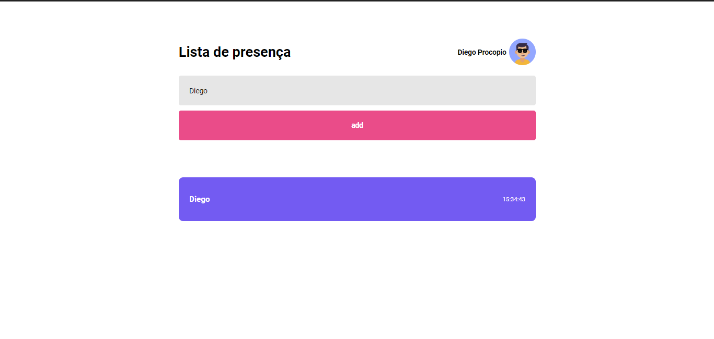

<h1 align="center"> Lista de presença </h1>

## 🚀 Tecnologias utilizadas

- React

## 🚀 Linguagem utilizada

- TypeScript

## 💻 Sobre o Projeto

 Esse projeto é uma lista de preseça aonde você entra no site e digitar o nome e ele guarda essa informação e mostra em tela, que támbem foi consumida a api do github para mostrar as informações de perfil, como nome e avatar.

 ## Imagem do projeto

 

 
By Diego Silva
   
